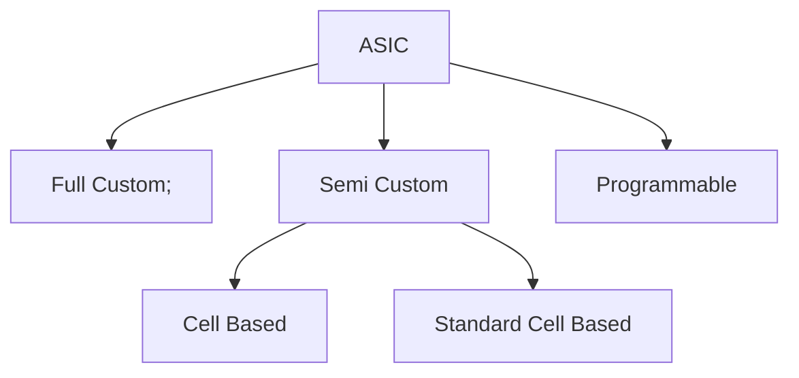

# Physical Design Flow
The Physical design flow is as follows : 


Most of the Chip design falls into following categories as shown in below Flow diagram. Majority of the Semiconductor comapines target for ASIC's based and in that Standard cell based Methodology. The target based methodology is Standard Cell Based becuase to reduce the design time, reduce NRE (Non Recurring Engineering) cost, reduce the TAT (Turn around time) and faster Time to Market. Faster and Efficient delivery of the chips to customer. The Lead time for the chips will be around 18 months to 24 months. Hence, Majority of the Semiconductor companies go for Standard cell based approach. 



# Standard Cell Based Approach
In this approach majority of the standard cells are defined and delievered by the Foundaries (TSMC, Samsung, Intel, Global Foundries, Micron, SKHynix and many more). They deliver the standard cells because to save time, money and reduce risk by using a predesigned, pretested and precharacterized. The Foundry are responsible for design of the cell library and fabricate all layers of ASIC for each design. 

In Standard cell we have following categories : 
- Channeled Gate Array.
- Channel less Gate Array.
- Structured Gate Array.

Based on the applications the suitable one will be choosen. 


# Floorplan

Goals of Floor Planning
```
- Define Core and Die Area of the chip
- Placement of Physical cells.
- The overall cell is defined including cell size, supply network.
- Arrange the blocks/IP's as flexible and fixed on the chip.
- Decide the location of the I/O's pads.
- Decide the location and number of Power pads.
- Decide the Power Distribution Network (PDN) : Place the VDD and VSS Power rails alternatively in Horizontal and Vertical Metal layers.
- Decide the Location and Type of Clock Distribution.
- Utilization percentage : 80 to 85% at end of the Physical design.
```

Guidelines for a Good Floorplan


In below snippet we can see the standard rows where the standard cells get placed in these rows. 


## Physical Synthesis 


- 𝑈𝑡𝑖𝑙𝑖𝑧𝑎𝑡𝑖𝑜𝑛 𝐹𝑎𝑐𝑡𝑜𝑟 =  ((𝐴𝑟𝑒𝑎 𝑂𝑐𝑐𝑢𝑝𝑖𝑒𝑑 𝑏𝑦 𝑁𝑒𝑡𝑙𝑖𝑠𝑡))/((𝑇𝑜𝑡𝑎𝑙 𝐴𝑟𝑒𝑎 𝑜𝑓 𝑡ℎ𝑒 𝑐𝑜𝑟𝑒) )
- 𝐴𝑠𝑝𝑒𝑐𝑡 𝑅𝑎𝑡𝑖𝑜 =  (( 𝐻𝑒𝑖𝑔ℎ𝑡))/((𝑊𝑖𝑑𝑡ℎ) )

## Preplaced Cells
These are Macros, IP's, Memory cells are part of complex logic. 

## Physical Cells
- TIE Cells
- TAP Cells
- Spacer Cells
- Feedthrough Cells
- Power Cells
- Decap Cells
- Boundary/End cap Cells

Link : https://www.physicaldesign4u.com/2019/12/physical-only-cells.html

Defining the Blockage for not placing the cells in those defined region. 

# LAB WORK
The variables defined for Floorplanning are as shown below : 


## Floorplan Tcl Script Configuration
The floorplan tcl script used for configuring the simulation. 


```
run_floorplan
```


Opening the Magic Tool. The cirrent directory is in <TIMESTAMP>/results/floorplan
```
magic -T /home/vsduser/Desktop/work/tools/openlane_working_dir/pdks/skylane130A/libs.tech/magic/sky130A.tech lef read ../../tmp/merged.lef def read picorv32a.floorplan.def
```


```
s    - Used to select the object.
v    - center the Die.
what - dispalys the details of the object.
```

In below section shows the object of pins are routed in metal2.


All the logic blocks standard cells are placed in left side corner.


## Placement 
The process of arraging circuit components on a layout surface. The input are Set of fixed modules, netlist. The output is best position for each module based on the cost functions.

Optimize of the placement

```
- The cost function include wire length, wire routability, hotspots, performance, I/O pads.
- Arrange all the Standard cells within in the chip.
- Minimize the total estimated interconnect length.
- Meet the timing requirements for critical nets.
- Minimize the interconnect congestion.
```


```
run_placement
```


After the command ran : 


```
magic -T /home/vsduser/Desktop/work/tools/openlane_working_dir/pdks/skylane130A/libs.tech/magic/sky130A.tech lef read ../../tmp/merged.lef def read picorv32a.placement.def
```

Opening the Chip after run_placement stage


Placement of the Standard cells in Standard rows


## Cell Design Flow


The CDL(Circuit Descrption language)  


### Characterization Flow


  


