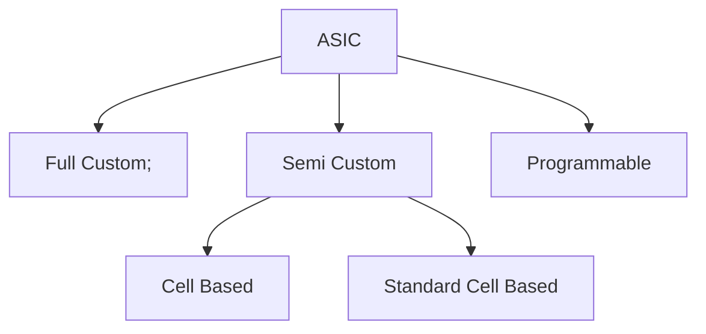

# Physical Design Flow
The Physical design flow is as follows : 


Most of the Chip design falls into following categories as shown in below Flow diagram. Majority of the Semiconductor comapines target for ASIC's based and in that Standard cell based Methodology. The target based methodology is Standard Cell Based becuase to reduce the design time, reduce NRE (Non Recurring Engineering) cost, reduce the TAT (Turn around time) and faster Time to Market. Faster and Efficient delivery of the chips to customer. The Lead time for the chips will be around 18 months to 24 months. Hence, Majority of the Semiconductor companies go for Standard cell based approach. 



# Standard Cell Based Approach
In this approach majority of the standard cells are defined and delievered by the Foundaries (TSMC, Samsung, Intel, Global Foundries, Micron, SKHynix and many more). They deliver the standard cells because to save time, money and reduce risk by using a predesigned, pretested and precharacterized. The Foundry are responsible for design of the cell library and fabricate all layers of ASIC for each design. 

In Standard cell we have following categories : 
- Channeled Gate Array.
- Channel less Gate Array.
- Structured Gate Array.

Based on the applications the suitable one will be choosen. 


# Floorplan

Goals of Floor Planning
```
- Define Core and Die Area of the chip
- Placement of Physical cells.
- The overall cell is defined including cell size, supply network.
- Arrange the blocks/IP's as flexible and fixed on the chip.
- Decide the location of the I/O's pads.
- Decide the location and number of Power pads.
- Decide the Power Distribution Network (PDN) : Place the VDD and VSS Power rails alternatively in Horizontal and Vertical Metal layers.
- Decide the Location and Type of Clock Distribution.
- Utilization percentage : 80 to 85% at end of the Physical design.
```

Guidelines for a Good Floorplan


In below snippet we can see the standard rows where the standard cells get placed in these rows. 


## Physical Synthesis 


- 𝑈𝑡𝑖𝑙𝑖𝑧𝑎𝑡𝑖𝑜𝑛 𝐹𝑎𝑐𝑡𝑜𝑟 =  ((𝐴𝑟𝑒𝑎 𝑂𝑐𝑐𝑢𝑝𝑖𝑒𝑑 𝑏𝑦 𝑁𝑒𝑡𝑙𝑖𝑠𝑡))/((𝑇𝑜𝑡𝑎𝑙 𝐴𝑟𝑒𝑎 𝑜𝑓 𝑡ℎ𝑒 𝑐𝑜𝑟𝑒) )
- 𝐴𝑠𝑝𝑒𝑐𝑡 𝑅𝑎𝑡𝑖𝑜 =  (( 𝐻𝑒𝑖𝑔ℎ𝑡))/((𝑊𝑖𝑑𝑡ℎ) )

## Preplaced Cells
These are Macros, IP's, Memory cells are part of complex logic. 

## Physical Cells
- TIE Cells
- TAP Cells
- Spacer Cells
- Feedthrough Cells
- Power Cells
- Decap Cells
- Boundary/End cap Cells

Link : https://www.physicaldesign4u.com/2019/12/physical-only-cells.html

Defining the Blockage for not placing the cells in those defined region. 


  


